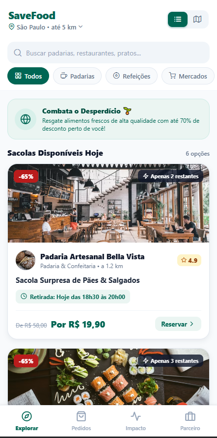
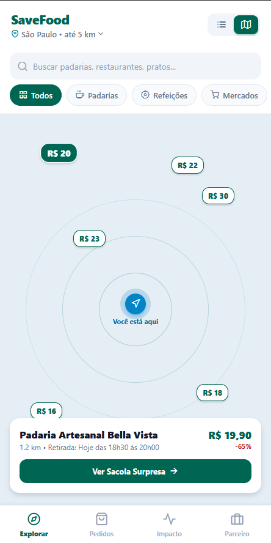
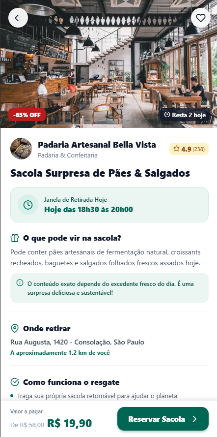
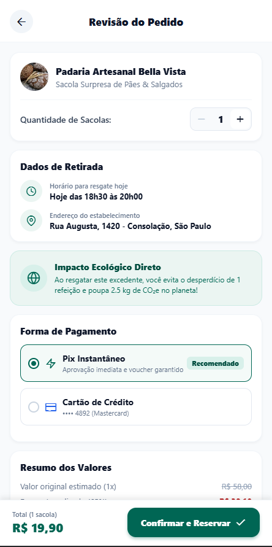
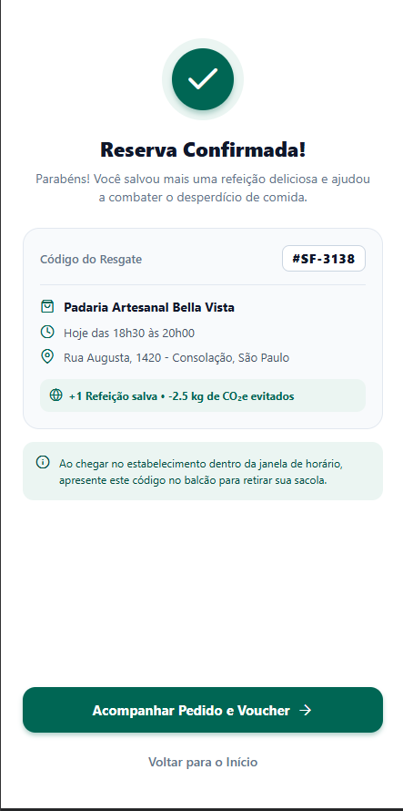
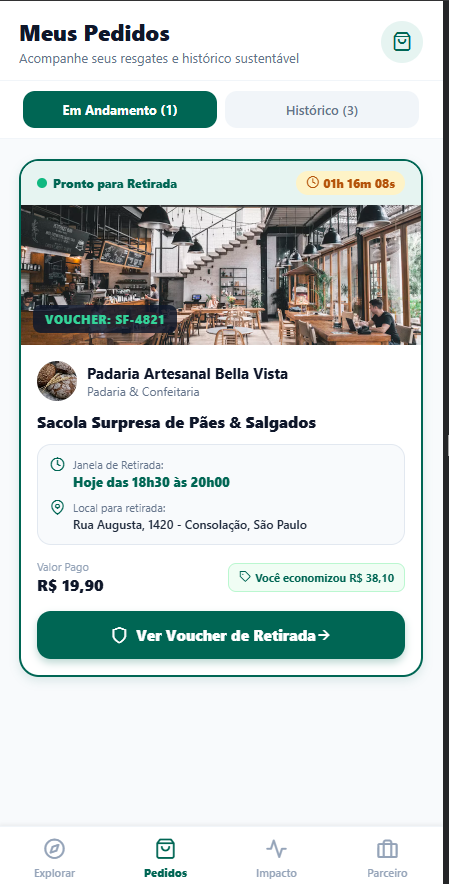
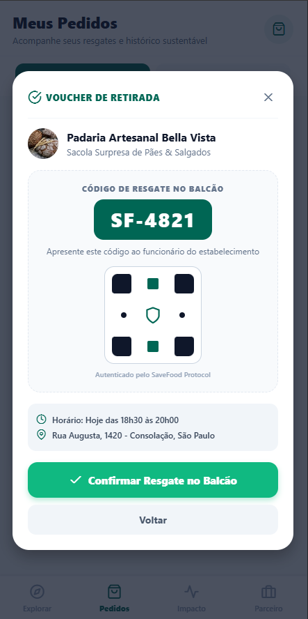
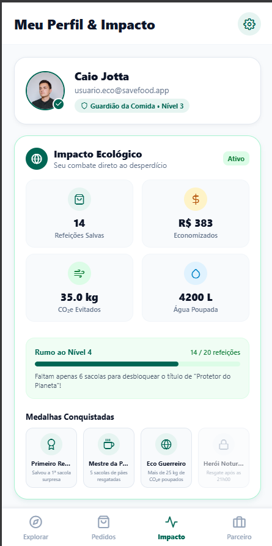
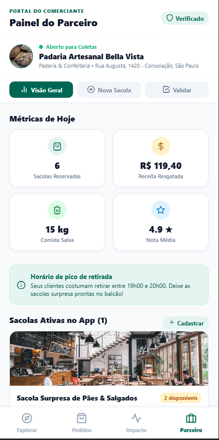

# SaveFood 🥗

Aplicativo mobile híbrido desenvolvido com **React Native** e **Expo**, inspirado no modelo internacional do *Too Good To Go*. O objetivo é combater o desperdício alimentar conectando padarias, restaurantes, mercados e confeitarias a consumidores para o resgate de **Sacolas Surpresa** com até 70% de desconto.

---

## 👥 Integrantes da Dupla
* **Yago Jardim**
* **Caio Cezar**

---

## 📱 Funcionalidades Desenvolvidas

### 🟢 Módulo 1 (Exploração, Reserva e Pedidos - Yago):
1. **Feed de Oportunidades:**
   * Listagem de sacolas surpresa disponíveis no dia com fotos de alta qualidade.
   * Badges de desconto (-65%), contador de itens restantes e notas de avaliação.
   * Barra de busca em tempo real por nome do estabelecimento ou produto.
   * Carrossel de filtros por categoria (Todos, Padarias, Refeições, Mercados, Doces & Bolos, Vegano).
2. **Visualização em Mapa Interativo:**
   * Alternador rápido entre Lista e Mapa no cabeçalho.
   * Radar de distância com pins dos estabelecimentos geolocalizados exibindo os preços.
   * Card flutuante de prévia ao tocar nos pins para navegação rápida.
3. **Detalhes da Sacola Surpresa:**
   * Galeria e foto de capa com favoritos e botão de retorno.
   * Informações completas do estabelecimento e janelas de horário de retirada.
   * Explicação didática do conceito da Sacola Surpresa.
   * Endereço da loja e regras de resgate no balcão.
4. **Checkout e Revisão da Reserva:**
   * Seletor interativo de quantidade de sacolas com atualização em tempo real.
   * Cálculo de impacto ecológico positivo (refeições salvas e kg de CO₂e evitados).
   * Opções de pagamento simulado (Pix Instantâneo e Cartão de Crédito).
   * Detalhamento de valores, descontos e total a pagar.
5. **Confirmação e Recibo Digital:**
   * Tela de sucesso com código do pedido (#SF-XXXX).
   * Orientações de coleta e botão de direcionamento para acompanhamento de vouchers.

### 🔵 Módulo 2 (Gestão, Perfil e Parceiros - Caio):
1. **Meus Pedidos & Acompanhamento:**
   * Card destacado com pedido ativo do dia e cronômetro regressivo de retirada ao vivo.
   * Histórico detalhado de resgates concluídos com cálculo de dinheiro economizado e refeições salvas.
   * Alternador dinâmico de abas entre "Em Andamento" e "Histórico".
2. **Voucher Digital Autenticado:**
   * Modal seguro com código de resgate no balcão (#SF-XXXX) e QR code estilizado.
   * Botão de confirmação de resgate com atualização de status e sincronização automática.
3. **Perfil & Painel de Impacto Verde:**
   * Contadores ecológicos acumulados (refeições salvas, R$ economizados, kg de CO₂e evitados, litros de água poupados).
   * Sistema de gamificação com níveis ecológicos (ex: "Guardião da Comida") e barra de progresso.
   * Grid de medalhas de conquista e seleção interativa de preferências alimentares.
4. **Portal do Estabelecimento Parceiro:**
   * Dashboard comercial com métricas do dia (sacolas reservadas, receita resgatada, comida salva e nota média).
   * Formulário completo para cadastro de sacolas excedentes com cálculo dinâmico de desconto.
   * Ferramenta de validação de vouchers digitais com feedback instantâneo e histórico de clientes atendidos.

---

## 📸 Demonstração Visual do Aplicativo

### 🛒 1. Descoberta & Detalhes da Sacola Surpresa
Navegue pelo feed geolocalizado, localize estabelecimentos em radar no mapa e veja todas as informações da sacola surpresa antes de reservar:

<p align="center">
  
  &nbsp;&nbsp;
  
  &nbsp;&nbsp;
  
</p>

| Feed de Oportunidades | Mapa em Tempo Real | Detalhes & Regras |
| :---: | :---: | :---: |
| Sacolas do dia com até 70% OFF, filtros e busca. | Radar com pins de preços e card de seleção rápida. | Fotos, horários de coleta, conceito e botão de reserva. |

---

### 💳 2. Checkout, Confirmação & Acompanhamento
Simulação de compra rápida por Pix ou Cartão, geração de código de resgate e contagem regressiva para retirada:

<p align="center">
  
  &nbsp;&nbsp;
  
  &nbsp;&nbsp;
  
</p>

| Checkout & Pagamento | Confirmação da Reserva | Acompanhamento do Pedido |
| :---: | :---: | :---: |
| Seletor de quantidade, impacto de CO₂ e Pix/Cartão. | Recibo digital com código único gerado (#SF-XXXX). | Cronômetro ao vivo até a retirada e resumo financeiro. |

---

### 🌿 3. Resgate no Balcão, Métricas Verdes & Portal do Lojista
Apresentação do voucher autenticado, painel de sustentabilidade do consumidor e gestão completa para comerciantes parceiros:

<p align="center">
  
  &nbsp;&nbsp;
  
  &nbsp;&nbsp;
  
</p>

| Voucher Digital no Balcão | Perfil & Impacto Verde | Painel do Estabelecimento |
| :---: | :---: | :---: |
| Código de resgate e botão de confirmação de entrega. | Nível ecológico, CO₂ evitado e medalhas de combate ao desperdício. | Métricas financeiras, cadastro de sacolas e validador de vouchers. |

## 🛠️ Tecnologias Utilizadas
* **React Native** (v0.86)
* **Expo** (SDK 57)
* **Expo Vector Icons** (Feather)
* **JavaScript / JSX Moderno**

---

## 🚀 Como Executar o Projeto

1. **Clone o repositório:**
```bash
git clone https://github.com/yagojardimm/TOO-GOOD-TO-GO.git
cd TOO-GOOD-TO-GO
```

2. **Instale as dependências:**
```bash
npm install
```

3. **Inicie o servidor de desenvolvimento:**
```bash
npx expo start
```

* **No celular:** Abra o aplicativo **Expo Go** e escaneie o QR Code exibido no terminal.
* **No navegador web:** Pressione `w` no terminal para executar a versão web.
